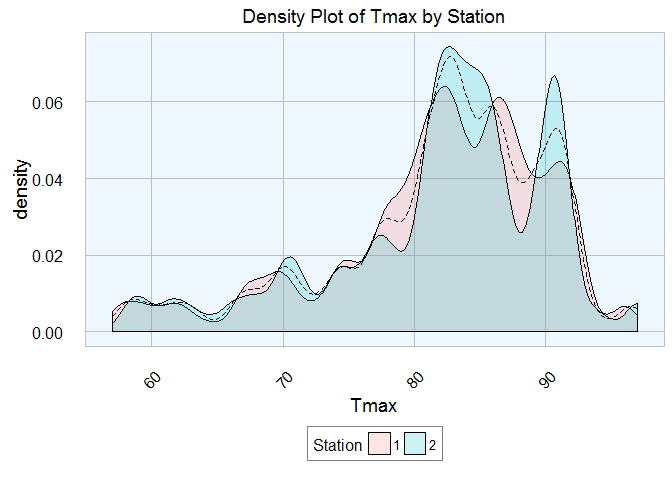
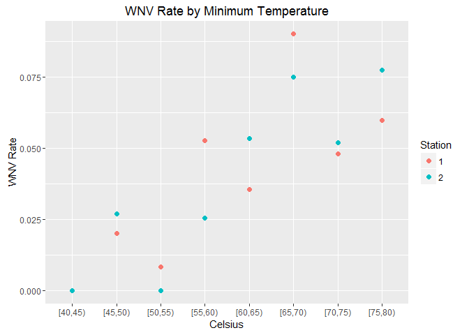
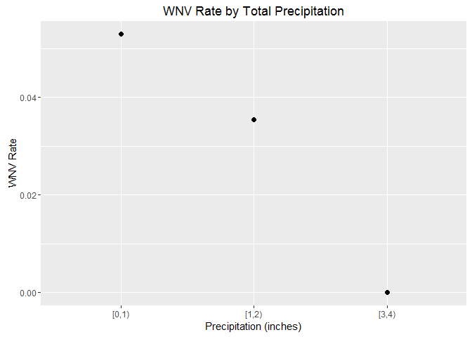
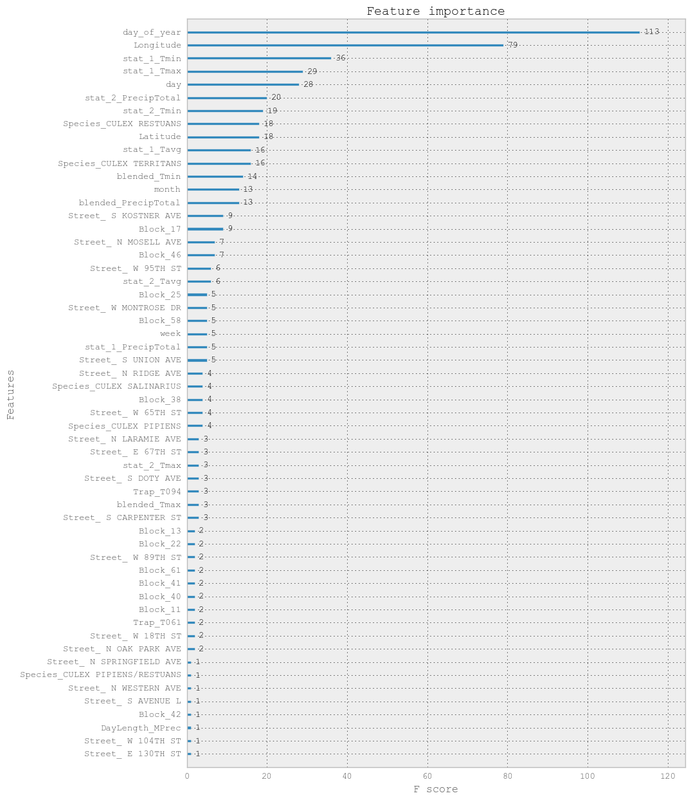
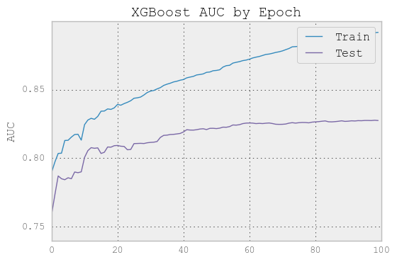
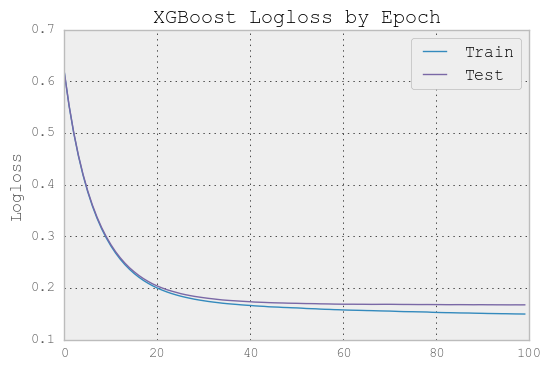
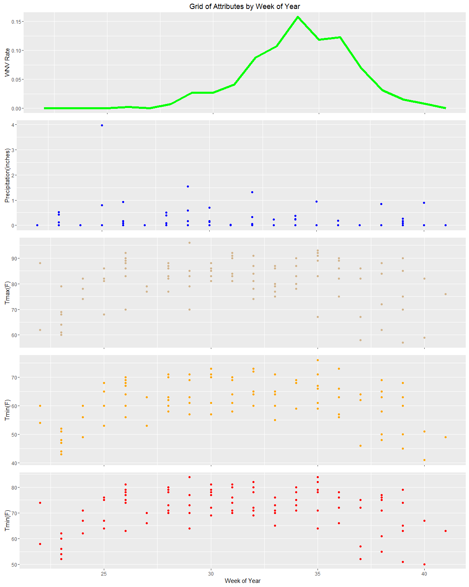

# Machine Learning Engineer Nanodegree
## Capstone Project (West Nile Virus Prediction in Chicago)
Andrew Bauman, PhD
Q1 2017

## I. Definition

### Project Overview

West Nile virus (WNV), which can result in [West Nile Fever]( https://en.wikipedia.org/wiki/West_Nile_fever) is a bloodborne virus that whose mode of transmission is primarily mosquito to human. According to the World Health Organization [West Nile Virus Fact Sheet]( http://www.who.int/mediacentre/factsheets/fs354/en/)

-	West Nile virus can cause a fatal neurological disease in humans.
-	Approximately 80% of people who are infected will not show symptoms.
-	West Nile virus is mainly transmitted to people through the bites of infected mosquitoes.
-	The virus can cause severe disease and death in horses.
-	Vaccines are available for use in horses but not yet available for people.
-	Birds are the natural hosts of West Nile virus.

#### Transmission and Control Considerations

-	WNV is maintained through a mosquito --> bird --> mosquito cycle where birds are the reservoir hosts
-	The principle vector is considered to be mosquitoes of genus _Culex_ particularly _Cx Pipiens_
-	Birds in North America are particularly susceptible to WNV where infection is highly pathogenic, particularly in crows
-	While birds are a reservoir host, horses are a dead-end host (become infected but don’t spread the infection)
-	WNV outbreaks in animals typically precede human cases so animal health surveillance (bird and horse) are important for early warnings
-	Vector control is achieved through mosquito surveillance and control.  Control  measures consist mainly of source reduction which includes:
    + elimination of mosquito breeding areas through water management (stagnant water is a breeding ground for mosquitoes)
    + administration of chemical and biological agents to destroy mosquito populations


#### West Nile Virus in Chicago

The first cases of West Nile in Chicago were reported in 2002 and by 2004 the City of Chicago and the Chicago Department of Public Health (CDPH) had established a comprehensive surveillance and control system.

- Every week from late spring through the fall, mosquitos in traps across the city are tested for the virus - - Results of these tests influence when and where the city will spray airborne pesticides to control adult mosquito populations.
- The associated [Kaggle competition](https://www.kaggle.com/c/predict-west-nile-virus) asks developers to predict when and where different species of mosquitos will test positive for West Nile virus, in an effort to more effectively allocate surveillance and control resources.

#### Personal Interest

This competition is particularly interesting to the author of this report due to personal contributions to efforts directed at recommending safe and effective control strategies (spray agents as well as timing and manner of spraying) while a graduate student in **Oregon State University's Department of Environmental and Molecular Toxicology Department**.


### Problem Statement

From the [Kaggle competition description](https://www.kaggle.com/c/predict-west-nile-virus):

> Given weather, location, testing, and spraying data, this competition asks you to predict when and where different species of mosquitos will test positive for West Nile virus. This is a classification problem.

More specifically, from the [Data](https://www.kaggle.com/c/predict-west-nile-virus/data) section:

> In this competition, you will be analyzing weather data and GIS data and predicting whether or not West Nile virus is present, for a given time, location, and species.

The origin of this data is as follows:

- Public health workers set up traps from late May to early October
- From M - W of each week the traps collect mosquitos which are tested for West Nile by the end  of the week
- Test results include [number of mosquitoes, mosquito species, presense or absence of WNV for the cohort]


#### Overview of Data

##### Main Data (Trap Data)

- Each record represents up to 50 tested mosquitos
- Trap locations are described by block number and street name and mapped to Longitude and Latitude
- Satellite traps were used to enhance surveillance.  Each satellite is name by postfixing letters on the parent trap identifier (e.g. T220A is a satellite of T220)
- Not all locations are tested at all times and records only exist when particular species is found at a certain trap at a certain time.  While predictions will be made on all possible combinations, only actual observations will be scored.


##### Spray Data

- GIS data from 2011 - 2013 mosquito spraying
- Spraying reduces mosquito populations and may impact the presence of WNV
- This data will not be incorporated into initial models but may be utilized during
model refinement to see if it leads to improvements


##### Weather Data

- NOAA weather data from 2007 - 2014 during test months
- Hot and dry conditions may favor WNV relative to cold and wet conditions
- Monitoring stations:
    + Station 1: CHICAGO O'HARE INTERNATIONAL AIRPORT Lat: 41.995 Lon: -87.933 Elev: 662 ft. above sea level
    + Station 2: CHICAGO MIDWAY INTL ARPT Lat: 41.786 Lon: -87.752 Elev: 612 ft. above sea level
- Missing date is indicated by "M" (missing) and "T" (trace)

##### Map Data

- Map data is provided from Open Streetmap
- Map data is primarily for visualization purposes but may also be used in model development


#### Evaluation

From the [submission section of the competition](https://www.kaggle.com/c/predict-west-nile-virus/details/evaluation)

> Submissions are evaluated on area under the ROC curve between the predicted probability that West Nile Virus is present and the observed outcomes.


#### Process and Submission

- The model will be developed on public training data and test data both supplied by the host
- The model will be evaluated on private test data supplied by the host, but not revealed to developers

From the submission section of the competition:

> For each record in the test set, you should predict a real-valued probability that WNV is present. The file should contain a header and have the following format:

**Example:**

```
Id,WnvPresent
1,0
2,1
3,0.9
4,0.2
etc.
```

#### Approach to Model Development

This task is well suited to supervised binary classification models, and specifically those models which generate reliable probabilities. Not all supervised models are amenable to this, Naive Bayes models, I'm looking at you.  I will most likely start with an out of the box ensemble model that scales well, such as XGBoost, but may also try a neural net or neural net based deep learning model using Keras.

- Prepare Data (wrangling, pre-processing, etc.)
- Explore data
- Perform additional preparation as revealed by exploration (address outliers and missing data, engineer features, transform data, etc.)
- Determine candidate feature set
- Train and Test models
- Pick model(s) to move into development
- Tune model(s)
- Revisit any previous steps to further inform model
- Create reslts ensembles

Submissions to the privae test set for the competition will be
submitted at major steps to assess performance.


### Metrics

Each model will be evaluated by the Area Under the Curve (AUC) of its Receiver Operating Characteristics (ROC) curve.
Several other acronyms may be thrown in as part of an psuedo-intellectual shock and awe campaign.

A ROC curve is well explained [here](http://www.dataschool.io/roc-curves-and-auc-explained/).  Essentially it is a plot of True positives as a function of false positives where each point on the curve is a (x, y) is the (tru pos, false pos) at any given probability cutoff threshold.  That is the threshold in a binary classification where we label a data instance as one class or another.  By integrating to
we return the AUC, a single number by which we can compare models.  The larger the
AUC the better the model is at discriminating between classes.

## II. Analysis

### Data Exploration


#### Training Data

The training data consists of 12 columns as described below and is comprised of
the odd data years 2007, 2009, 2011, and 2013.


**Training Data**

```
Data columns (total 12 columns):

Date                      10506 non-null datetime64[ns]
Address                   10506 non-null object
Species                   10506 non-null object
Block                     10506 non-null int64
Street                    10506 non-null object
Trap                      10506 non-null object
AddressNumberAndStreet    10506 non-null object
Latitude                  10506 non-null float64
Longitude                 10506 non-null float64
AddressAccuracy           10506 non-null int64
NumMosquitos              10506 non-null int64
WnvPresent                10506 non-null int64
```
The following columns will be excluded from the training data:

```python
['Address', 'AddressNumberAndStreet', 'AddressAccuracy', 'NumMosquitos']
```
Data will be used to merge the  weather and train/test data and will then
be removed.  Note that NumMosquitos was removed because it is not a test data field.

#### Test Data

The test data consists of 11 columns as described below and is comprised of the
even data years 2008, 2010, 2012, 2014.

**Test Data**
```
Data columns (total 11 columns):
Id                        116293 non-null int64
Date                      116293 non-null datetime64[ns]
Address                   116293 non-null object
Species                   116293 non-null object
Block                     116293 non-null int64
Street                    116293 non-null object
Trap                      116293 non-null object
AddressNumberAndStreet    116293 non-null object
Latitude                  116293 non-null float64
Longitude                 116293 non-null float64
AddressAccuracy           116293 non-null int64
```
The following columns will be excluded from the test data:

```python
['Address', 'AddressNumberAndStreet', 'AddressAccuracy', 'Id']
```
Data will be used to merge the  weather and train/test data and will then
be removed.

##### Weather Data

The weather data consists of 22 columns as described below. Station 1 has the  full
complement of data whereas Station 1 is  missing [depart, depth, water1, snowfall
sunset, and sunrise]


**Weather**
```
Data columns (total 22 columns):
Station        2944 non-null object
Date           2944 non-null datetime64[ns]
Tmax           2944 non-null int64
Tmin           2944 non-null int64
Tavg           2944 non-null object
Depart         2944 non-null object
DewPoint       2944 non-null int64
WetBulb        2944 non-null object
Heat           2944 non-null object
Cool           2944 non-null object
Sunrise        2944 non-null object
Sunset         2944 non-null object
CodeSum        2944 non-null object
Depth          2944 non-null object
Water1         2944 non-null object
SnowFall       2944 non-null object
PrecipTotal    2944 non-null object
StnPressure    2944 non-null object
SeaLevel       2944 non-null object
ResultSpeed    2944 non-null float64
ResultDir      2944 non-null int64
AvgSpeed       2944 non-null object
```

The body of literature regarding WNV mosquito populations and meteorological factors
will be leveraged to select weather features. Only those features which have been
well established in the literature to be predictive of WNV will be retained.  While
other features may be predictive to this local data set a strategy of using literature
validated features may promote a lower variance (more general) model. Literature
information may also inform any features to be engineered.

** Retained Weather Features **
```
- Station (will be dropped once data sets are complete)
- Date (for use in merging data sets)
- Tmax: Daily maximum temperature in Fahrenheit
- Tmin: Daily minimum temperature in Fahrenheit
- Tavg: Daily average temperature in Fahrenheit
- Depart: Departure from normal temperature in Fahrenheit
- Heat: Heating trend over historical norms
- Cool: Cooling trend over historical norms
- Sunrise: Calculated time of sunrise CST
- Sunset: Calculated sunset CST
- PrecipTotal
```

**Weather Stations**

There are two weather stations which contributed to the weather data.  There are
several options for handling this and I have chosen to handle it in the following
manner.

1.  Train models considering each station separately
2.  Train a model with blended (mean) station data

Another option is to calculate which station is nearest each trap and use that data
however geographical proximity to the station does not necessarily mean that stations
reading is more accurate than another, given that neither station is significantly
distant from any trap and that local terrain and geographical features may have such
an impact as to render distance less relevant. Were this strategy to be employed
the Haversine formula would be used since it accounts for the curvature of the earth.


##### Selected Weather Related Literature

There are several key references that help explain the relationship between
weather and WNV. An important take home message is that many of the WNV predictive
models that incorporate climate data are based on temperature and precipitation
departures from long term averages (30 year averages etc.), as well as factors
such as level of precipitation several months prior to the data we are using, for
each year (precipitation during major larvae hatch periods informs the base mosquito
population)  While this information is not part of the data allowed for this
competition many of the spatio-temporal models also use shorter term averages as
well as general concepts that will help inform decisions for the models developed
in this project.

- [Illinois WNV Threat and Climate Division Model](http://mrcc.isws.illinois.edu/research/westnile/IL_CD/index.jsp)
    + climate divisions as the basic spatial unit to aggregate non-homogenous WNV human and mosquito case sampling, and for averaging daily weather data
    + use of precipitation and temperature departures from daily 30-year normals, rather than based on weekly degree days
    + incorporation of 10-day daily temperature and 3-day daily precipitation forecasts to increase the lead time of model usefulness
    + incorporation of the number of mosquito pools testing positive for WNV as reported to the Illinois Department of Public Health

- [Meteorological Conditions Associated with Increased Incidence of West Nile Virus Disease in the United States, 2004–2012](http://m.ajtmh.org/content/92/5/1013.long?view=long&pmid=25802435) A general discussion of weather factors impacting occurence of WNV.
- [The Effects of Weather and Environmental Factors on West Nile Virus Mosquito Abundance in Greater Toronto Area](http://journals.ametsoc.org/doi/pdf/10.1175/EI-D-15-0003.1) Development of a spatiotemporal model variability in Culex pipiens and it's impact on WNV
- [West Nile Virus and Climate](https://www.ncbi.nlm.nih.gov/pmc/articles/PMC3456354/pdf/11524_2006_Article_34.pdf)
- [Local impact of temperature and precipitation on West Nile virus infection in Culex species mosquitoes in northeast Illinois, USA](https://parasitesandvectors.biomedcentral.com/articles/10.1186/1756-3305-3-19) Discusses temporal and spatial patterns of precipitation and air temperature on the timing and location of increased mosquito infection in the northeastern Illinois area.
- [Climate and Weather Impacts on West Nile Virus](http://www.mimosq.org/presentations/2016/4WestcottClimateWNV.pdf) An excellent summary of the impact of climate and weather on WNV prevalence in Illinois and MI (summarizes much of the first few references in a slide show)


##### Geographical Considerations

The following publication highlights increased WNV risk as a function of proximity
to the Des Plaines River (Cook County Illinois). This may bare some relevance to
the current task but also suggests, as common sense would dictate, that proximity
to major water bodies may be a useful feature in predicting WNV mosquito prevalence.

http://online.liebertpub.com/doi/pdfplus/10.1089/vbz.2006.6.91

#### Outliers

No algorithm (Tukey's etc) was run to detect outliers.  Instead data was visually inspected for unusual values during EDA.

#### Examine and Handle Missing Data

The train and test sets do not contain missing data.

The weather data set has a substantial amount of missing data, mostly in Station 2.  Missing data appears as ```-```, 'T', or 'M'.

**What is 'T' and 'M'?**
- From http://www.nws.noaa.gov/om/csd/info/NOWdata/FAQ.php

> "M" stands for "Missing". Data for an element will be missing if the primary sensor for that weather element is inoperable (e.g., has an outage) or malfunctioning (e.g., producing errant data) AND any collocated backup sensor is also inoperable or malfunctioning. "T" stand for "Trace". This is a small amount of precipitation that will wet a rain gauge but is less than the 0.01 inch measuring limit.

All of the missing data is from Station 2.  Station one has 163 instances of 'T',
in the for PrecipTotal.  For Station 2 we have:

- 'M': {'Heat': 11, "Cool": 11, "Depart: 1472", "Tavg": 11, "PrecipTotal": 2}
- '-': {"Sunrise": 1472, "Sunset": 1472}
- 'T': {"PrecipTotal": 155}

1472 records represents all rows for Station 2, meaning that Station 2 does is
missing all Sunrise and Sunset data as well as Depart.  Sunrise and Sunset data
are calculated and should not differ substantially between stations.  So Station 1
Sunrise and Sunset were used to fill for Station 2.  Values of "T" for PrecipTotal
were filled a value of 0.005. It's tempting to make these 0 but actually small
amounts of rain in Midwest climate zones (an amount of rain that tends to form
stagnant water pools such as "puddles")are correlated with West Nile Virus.  Given
this, 0 is unlikely to be the best choice.  All other missing data was filled from
Station 1 as values are unlikely to differ substantially.

Another peculiarity of the data is that 48 Sunset records contained were not validate
military time values.  For example using 1160 hours instead of 1200 hours. This was
addressed by rolling each instant back 1 minute such that 1160 would become 1159.
This was important for downstream feature engineering which required DateTime handling.

All data wrangling, data characterization, feature engineering, and related steps
are detailed in the references [?Put references here?]

#### Feature Engineering

The following features were engineered.  Those features in bold were evaluated during
feature selection. The remaining features were either redundant (night length for
example) or were rejected due to response during EDA.

- **day_of_year**: Integer representing the day of year
- **day**: Integer representing day of the month
- **month**: Integer representing the month
- **week_of_year**: Integer representing the week of the year
- **DayLength_MPrec**: Float of day length with precision in minutes
- **DayLength_NearH**: Length of day rounded to the nearest hour
- NightLength_MPrec: Float of night length with precision in minutes
- NightLength_NearH: Length of night rounded to the nearest hour
- **Sunrise_hours**: Elapsed time, in hours, from midnight to Sunrise
- **Sunset_hours**:  Elapsed time, in hours, from midnight to Sunset
- **blended_Tmax**: Average Tmax of Stations 1 and 2
- **blended_Tmin**: Average Tmin of Stations 1 and 2
- blended_Depart: Average depart of Stations 1 and 2
- blended_Heat: Average heat of Stations 1 and 2
- blended_Cool: Average cool of Stations 1 and 2
- **blended_PrecipTotal**: Average PrecipTotal of Stations 1 and 2


### Exploratory Visualization

EDA is performed and documented in the [EDA Highlights](WNV_EDA_Highlights.md). Each variable
was with the exception of Lat and Long was visualized (block and street level location
data was visualized instead since they are more general). Plots selected for their
are included below.


#### Density Plots
------------------

Overlaid density plots of Tmin and Tmax by station, where the dashed plot is the mean of the station data. Note that both stations cover the same temperature range, this information is not informative of whether or not to retain data from one station over another or to use the mean. This may be informed by plots temperature vs. WNV rates or through the ML feature selection process.



 #### WNV Rate by Location
 ------------------

The plots below demonstrate a clear relationship between location and the WNV rate.


#### WNV Rate by Species
------------------

This plot demonstrates a relationship between species and wNV presence.


#### WNV Rate by Length of Day
-------------------------

Longer days are associated with WNV presence.


#### WNV Rate by Sunrise Time
------------------------

The number of hours between sunrise and the beginning of the day is predictive of WNV presence.


#### WNV Rate by Temperature Related Variables
-----------------------------------------

WNV presence appears to follow rising temperatures. The plot for Tmax is particularly interesting as there may be a high and low temperature cluster.



Depart, heat, and cool do not appear to be particularly informative.


#### WNV Rate by Total Precipitation
-------------------------------

A model where lower precipitation is predictive of WNv presence is consistent with the literature for mid-west climate zones.



### Algorithms and Techniques

#### Feature Selection

Feature importance from XGBoost (boosted decision trees) will be used to Selection
the final feature set.  An iterable of importance thresholds will be passed to the
classifiers and a final threshold or n features will be selected on the basis of
performance on a hold out of the training set.  All data will be transformed
to extract these features prior to tuning, validation, and submission.


#### Algorithms

Both models are ensemble models using decision trees as their base estimators.
Ensemble methods combine the predictions of several base estimators to improve robustness
and reduce variance. In other words they produce a unified model which is greater
than the sum of its parts. Random Forest is a bagging model whereas XGBoost is a boosting model.

- **Base Estimator:** Both models employ decision trees as their base estimators
the final model is a an ensemble of these decision trees (weak learners). A decision tree
could be thought of as a diverter that uses attributes (features) of samples (records or instances)
to separate the samples into categories. Say we have 2 colors and sizes of balls,
small red and big red; small green and big green. We start with the balls all mixed
up into one pile. We want to dump the balls into a hopper and separate them into
4 piles based on size and color. First we use a sieve to separate small from big,
then the two groups, small green & red and big green & red tumble down to reach
a part of the system where color activated valves (opens based on green or red)
send green and red down separate pipes. In the end we have 4 piles each containing
one type of ball. Notice at each step the groups become more "pure" that is they
have fewer types of balls. This can also be thought of as increasing the order of
a system. The state of order or disorder in a system is referred to as entropy and
ideally the system becomes more ordered (balls separate) at each step. For our case
the decision tree splits attributes such as day of the year and total precipiation.
The split is assessed by seeing how much information is gained, that is how well
did we separate classes (passed or failed) at a particular split (measured by purity or entropy).

    + **Decision trees have some distinct advantages:**
    + Robust to feature scale (reduces feature preparation steps)
    + Low prediction cost
    + Effective using both numerical and categorical data
    + Interpretable (easy to understand)
    + The influence of features on predictions are easily understood and visualized


  A primary disadvantage is that decision trees are prone to overfitting. This
  is especially true of we allow a small number of samples to be split out at each
  step.  This would be akin to trying to generalize a sample result from a few
  people to a much larger population. TEnsembling tends to reduce this variance.

- **Boosting:** Boosting models combine weak learners (result of each individual learner is slightly better than random) to produce a strong learner using the gradient boosting algorithm. During training each estimator learns a portion of the data during several rounds of learning. As learning progresses the weak learners are boosted through performance based weighting. This way good performers are de-prioritized for training, and poor performers are prioritized. The end result is typically a well generalized and robust strong learner.

- **Bagging:** Bagging (Bootstrap Aggregating) models combine weak learners trained
on random samples of the data set.  First bootstrapping is employed through the creation of random sub-samples of the training data
set on which each classifier is trained. Finally the entire set of classifiers are combined
by voting (averaging or majority).

From my perspective an ideal model for this problem is:

- accurate
- computationally effecient (can be deployed and retrained on a city budget)
- robust
- interpretable (model resutls may need to be explained to city government officials
and their consituents)

Both algorithms were selected for their robust nature (robust to feature scale
and less prone to overfitting). XGBoost is particularly attractive due to it well earned reputation
as a high performing algorithm, both in terms of metric performance (learns the data
well) and system performance (fast and scalable).

It's also important to mention that feature selection is a critical step in any model
development process. Features can be selected and visualized using built-in feature
importance methods for both model implementatios in python. This is not only convenient
but lends itself well to explanation of the development proccess for non-ML experts
(the potential city government customer).

- Random Forest Default Parameters:
```python
RandomForestClassifier(bootstrap=True, class_weight=None, criterion='gini',
            max_depth=None, max_features='auto', max_leaf_nodes=None,
            min_impurity_split=1e-07, min_samples_leaf=1,
            min_samples_split=2, min_weight_fraction_leaf=0.0,
            n_estimators=10, n_jobs=1, oob_score=False, random_state=None,
            verbose=0, warm_start=False)
```

- XGBoost Default Parameters:
```python
XGBClassifier(base_score=0.5, colsample_bylevel=1, colsample_bytree=1,
       gamma=0, learning_rate=0.1, max_delta_step=0, max_depth=3,
       min_child_weight=1, missing=None, n_estimators=100, nthread=-1,
       objective='binary:logistic', reg_alpha=0, reg_lambda=1,
       scale_pos_weight=1, seed=0, silent=True, subsample=1)
```


### Benchmark

My benchmark benchmark is that dictated by the competition, which is 50%  In
other words, the initial task will be to produce an algorithm that performs better
than guessing. Initial models, untuned classifiers, will be compared to this benchmark
model. Later models that have been refined thorugh feature selection and tuning will
be compared to eachother at each progressive step, but the benchmark will remain
at guessing.  Guessing is essentially where the City of Chicago was prior to this
competition.


## III. Methodology

### Data Preprocessing

Data abnormalities and related processing as well as feature engineering have been
described in previous sections. This leaves handling of station data, categorical
variables, latitude and longitude, and feature selection.

#### Categorical variables

The final processing step was to transform categorical
features into dummies.  That is, each categorical value is transformed into its
own field where that feature takes a value of 1 where active (on) and 0 where inactive
(off).  Categorical variables transformed to dummies are Block, Street, Species,
and Trap.

#### Station Specific Data

EDA revealed enough difference between the two stations across variables that it
isn't clear which station should be used or if an average (blended) value should
be used.  Given this station specific data form Tmax, Tmin, PrecipTotal, and Tavg
were created.

#### Feature Selection

The initial feature set, prior to creation of dummies, consists of:

```python
      ['Species', 'Block', 'Street', 'Trap', 'Latitude',
       'Longitude', 'month', 'day', 'day_of_year', 'week',
       'stat_1_Tmax', 'stat_1_Tmin', 'stat_1_Tavg', 'stat_1_PrecipTotal',
       'DayLength_MPrec', 'DayLength_NearH', 'Sunrise_hours', 'Sunset_hours',
       'blended_Tmax', 'blended_Tmin', 'blended_PrecipTotal', 'stat_2_Date',
       'stat_2_Tmax', 'stat_2_Tmin', 'stat_2_Tavg', 'stat_2_PrecipTotal']
```

Dummies were created from the following features:
- Species
- Street
- Block
- Trap

It's interesting to note that after dummie varible transformation there were some features unique
to both the test and train sets.  This was solved by eliminating unique features
(they aren't relevant if not in test set, and if only in test set we don't have
data on which to train). At this point the feature set expanded to 356.

Feature selection continued with the use of XGBoost's built in feature importance function.  The plot below demonstrates that the vast majority of our 356 features do not impact the target variable.  The top 20 features are.

1. day_of_year
2. Longitude
3. stat_1_Tmin
4. stat_1_Tmax
5. day
6. stat_2_PrecipTotal
7. stat_2_Tmin
8. Species_Culex_RESTUANS
9. Latitude
10. stat_1_Tavg
11. Species_CULEX_TERRITANS
12. blended_Tmin
13. month
14. blended_PrecipTotal
15. Street_S_Kostner_Ave
16. Block_17
17. Street_W_95th_ST
18. stat_2_Tavg
19. Block_25
20. Street_W_Montrose_DR



Location data (Street, Block, Latitude, and Longitude) and trap data makes up a large proportion of total features. A course investigation of these features was carried out by submitting the XGboost and Random Forest models to the public and private test set with ALL features and then without location and trap based features. Specific results are tabulated in the results section, but suffice it to say that model performance suffered without these features. This is not suprising since there are several location based features in the top 20 features.

At this point the training data was further broken into a training and test set (referred to as "local validation set"), for purposes of feature selection and tuning. Both the XGBoost and Random Forest model AUC was assessed as a functon of feauture importance.  The code and full results for this can be foud here [WNV Model Jupyter Notebook](wnv_prep_model.ipynb).  The results indicated that most of the AUC is recovered by ~ 10 features.

### Implementation and Refinement
Given the information regarding feature importance threshold from the previous step, the training set, local validation set, and pubic test set were transformed at a threshold level corresponding to the top 12 features.  The model was trained on the full training set, predictons made on the public test set, and those prediction were submitted to the private test set.  Scores improved for both models and are presented in the results section.

A common cause of overfitting is using too many training rounds.  Afer a certain number of rounds, termed epochs, model bias is reduced at the expense of increased variance.  To account for this early stopping was investigated using the split training and local validation set.  See [The WNV Model Jupyter Notebook](wnv_prep_model.ipynb) for implementaton details.  The learning curves below capture results for XGBoost.





Both curves indicate that variance tends to increase in the neigborhood of 20 epochs.  To mitigate this the XGBoost model passed into tuning will be set with early stopping rounds of 10. That is, if the model does not improve for 10 rounds training will stop. There is no early stopping parameter for Random Forest, so this was not implemented.

#### Tuning
Finally our models are tuned to decrease bias.  Tuning was performed in the following manner:

- Transform all input data from test, local validation using a threshold that captures ~ 16 features. The target features are ~ top 12 per previous data and discussions. It's critical for the model that we not drop below ~ 10 - 12 features
but there is little penalty for going slightly beyond ~ 10 - 12 features.  To this end
a threshold was chosen that consistently resulted in ~ 16 features. While not entirlely
"optimal" this approach is entirely robust. Yes I put quotes around optimal.
- Tune each model using sklearn randomized search CV where the CV object is StratifiedShuffleSplit.
- XGBoost Parameter Distributions for Sampling and tuning parameters:

```python
n_estimators_dist= sps.randint(1, 300)
learning_rate_dist = [0.01, 0.02, 0.05, 0.1, .15, 0.2, .25, 0.3]
max_depth_dist = sps.randint(2, 12)
colsample_bytree_dist= np.arange(0.2, 0.6, .1)

cv = model_selection.StratifiedShuffleSplit(n_splits = 10, random_state = 42)

n_iter_search = 20
random_search_xgb = model_selection.RandomizedSearchCV(model, param_distributions=param_dist,
                                   n_iter=n_iter_search, scoring= 'roc_auc', cv= cv)
```
- XGBoost Best Estimator:
```python
XGBClassifier(base_score=0.5, colsample_bylevel=1,
       colsample_bytree=0.40000000000000008, gamma=0, learning_rate=0.3,
       max_delta_step=0, max_depth=2, min_child_weight=1, missing=None,
       n_estimators=175, nthread=-1, objective='binary:logistic',
       reg_alpha=0, reg_lambda=1, scale_pos_weight=1, seed=42, silent=True,
       subsample=1)
```
- Random Forest Parameter Distributions For Sampling and tuning parameters:

```python
n_estimators_dist= sps.randint(1, 1000)
cv = model_selection.StratifiedShuffleSplit(n_splits = 10, random_state = 42)

param_dist = {"max_depth": max_depth_dist,
              "max_features": sps.randint(1, n_features),
              "min_samples_split": sps.randint(2, 11),
              "bootstrap": [True, False],
              "criterion": ["gini", "entropy"],
             "n_estimators": n_estimators_dist}

# run randomized search
n_iter_search = 20
random_search_randfor = model_selection.RandomizedSearchCV(clf, param_distributions=param_dist,
                                   n_iter=n_iter_search, scoring= 'roc_auc')
```
- Random Forest Best Estimator
```python
RandomForestClassifier(bootstrap=True, class_weight=None, criterion='entropy',
            max_depth=11, max_features=2, max_leaf_nodes=None,
            min_impurity_split=1e-07, min_samples_leaf=1,
            min_samples_split=9, min_weight_fraction_leaf=0.0,
            n_estimators=891, n_jobs=1, oob_score=False, random_state=42,
            verbose=0, warm_start=False)
```

Both models were then tested on the local validation set (see results section).

XGBoost Training with native xgb class:

Finally the XGBoost Model was trained using the built in CV from the xgb class. The following process was used:

- convert training (all training data with no validation split but same feature selection) data to DMatrix format
- Run cv with the best paramaters above, for 3000 maximum rounds, with early stopping set for no improvement over 10 rounds.
- Determine number of rounds (88)
- Train using the best params and 88 boosting rounds

The test set was then converted to a Dmatrix and the tuned classifier was used to make predictons.  Predictions were submmitted against the public and private board (see results).

#### Ensembling Results

As an experiment I used code at this repo ```https://github.com/MLWave/Kaggle-Ensemble-Guide``` to combine results from both classifiers using voting (several methods) and averaging (several methods). Both methods led to decreased scores (see results) with voting having the worst performance.  This supports a scenario where where both classifiers have strong agreement by which I mean they are both wrong and right in the same way over the same slices of data. This is not suprising since they are both tree/stump based ensembles. To take advantage of voting and averaging of results divergent classifers should be included (orthogonal methods) such as SVM, NN, etc.


## IV. Results
_(approx. 2-3 pages)_

### Model Evaluation and Validation


**State**|**XG Public AUC**|**XG Private AUC**|**RF Public AUC**|**RF Private AUC**
:-----:|:-----:|:-----:|:-----:|:-----:|
All Features Untuned Default Model<sup>1</sup>|0.731|0.712|0.69705|0.65274
No Location/Trap Untuned Default Model<sup>1</sup>|0.684|0.678|0.695|0.682
Feature Transform (Top 12) Default Model<sup>1</sup>|0.736|0.713|0.703|0.657
Feature Transform (Top 16) Best Params Tuned Model<sup>3</sup>|0.725|0.703|0.721|0.686
Feature Transform (Top 16) Best Params CV Tune Early Stop|0.749|0.733|-|-
Best Vote Ensemble<sup>2</sup>|0.741|0.720|-|-
Best Mean Ensemble(Geometric Mean)<sup>2</sup>|0.709|0.699|-|-


<sup>1</sup> RF default with 1000 estimators

<sup>2</sup> Ensemble of both classifier results place under XG for comparison

<sup>3</sup> Validation set (split from test_merge) score ~0.82 for both models

From the results we observe:

- Initial naive XGBoost and Random Forest models are comparable to our fully tuned and feature selected models
- The XGBoost model is sensitive to location data.  This is not surprising given that some locations are in the top features
- Both models show signs of overfitting (validation set scores up to 10% greater than test scores)
- Voting and mean ensembles do not improve performance. This is likely due to model correlation.
It is not surprising that the models are correlated since the are both decision tree ensembles.

#### Model Comparisons to Benchmark

Recall that the benchmark model is 50% (random guessing). All models exceeded this benchmark by 15 - 22% (private AUC scores), including initial, untuned models. So, we did signfianctly better than guessing, which may enable
better use of spraying resources, but there is room for improvement.


## V. Conclusion


### Free-Form Visualization

WNV Rate by Week of Year Compared to Precipitation and and Temperature Attributes
---------------------------------------------------------------------------------



While considering results I sought to understand the underlying mechanisms governing
the presence of WNV.  I didn't explore the underlying mechanisms behind the relationship
between location and WNV presence since this is well understood to be a function
of proximity to mosquito breeding grounds (stagnant water sources).  This relationship
could also be a function of past spraying efforts in that some locations may have
been more heavily sprayed in the past, thus suppressing mosquitoes and West Nile
for those locations.  I was very curous about whether or not we could see a pattern
in climate conditions (temperature and precipitation) and changes in WNV rate.
It is clear from EDA and literature review that these relationships exist. Since
mosquitoes have a life cycle and WNV has a replication cycle reality is not a model where, for example, the
temperature is high today so there is going to be higher prevalance of West Nile.
We should be able to say that there are climate condtions within a discrete time period
from today that suggests a potential for higher prevalence of WNV. However, our model is looking
at the former (reactive model) rather than the latter (pro-active model).  If we
want to take a pro-active approach to spraying we need to get better at predicting
out x weeks from a trend in climate conditions. The goal would be to spray prior to WNV presence.  I created the figure above to illustrate
my point.  The first panel is WNV presence by week of the year (chose week of the
year to smooth out jumps in day of year data), the remaining panels are climate
attributes. Do you notice the pattern?  Neither do I and that is the point. To really
understand and model WNV prevalence we should arrange the time series data in a way
that our model can find a relationship between past climate events and WNV presence.

### Reflection and Improvement

The goal of this project was to build a model of WNV presence by location in the
city of Chicago, using climate (weather), location, and mosquito trap data.  The
use case for this model is to inform the city of Chicago where best to focus its
limited mosquito control (spraying) resources to prevent the spread of West Nile
Virus.  The process consisted of:

- Literature review
- EDA to built intuition for the data and selet initial features
- Build naive XGB and Random Forest models
- Explore impact of location data on models
- Perform additional feature selection in conjunction with initial model tuning
- Tune models with randomize parameter searching
- Train final models
- Explore voting and mean prediction ensembles

The most intersting part of this project was how most of the WNV presence
can be explained by day of the year.  Day of the year incorporates a lot of factors
including climate factors (i.e. August tends to be hotter and dryer than October).
In the end I realized that what we should actually be focused on is predicting
conditions that suggest the formation of WNV vs the actual detected presence.
This would allow strategic spraying of pre-WNV positive mosquito populations.

While this model did beat the benchmark I don't find it adequate. AUC performance
could likely be raised by building ensembles that include models orthogonal to
the current models (NN and SVM or example).  However, it wouldn't matter because
we are trying to predict the wrong thing.  We should be predicting impending
WNV, not detected WNV.  We could do this by studying time series data and using
interpolation.

### Resources

- AUC, ROC, and randomized Implementation code was heavily sourced from scikit-learn documenation and examples
- Approaches and code for XGB tuning and implementation was influenced and inspired by
  - Machine Learning Mastery: http://machinelearningmastery.com/develop-first-xgboost-model-python-scikit-learn/
  - This blog https://www.analyticsvidhya.com/blog/2016/03/complete-guide-parameter-tuning-xgboost-with-codes-python/
  - and This blog https://jessesw.com/XG-Boost/
- Initial approach and naive Random Forest model was inspired by this kernel https://www.kaggle.com/abhishek/predict-west-nile-virus/vote-me-up
